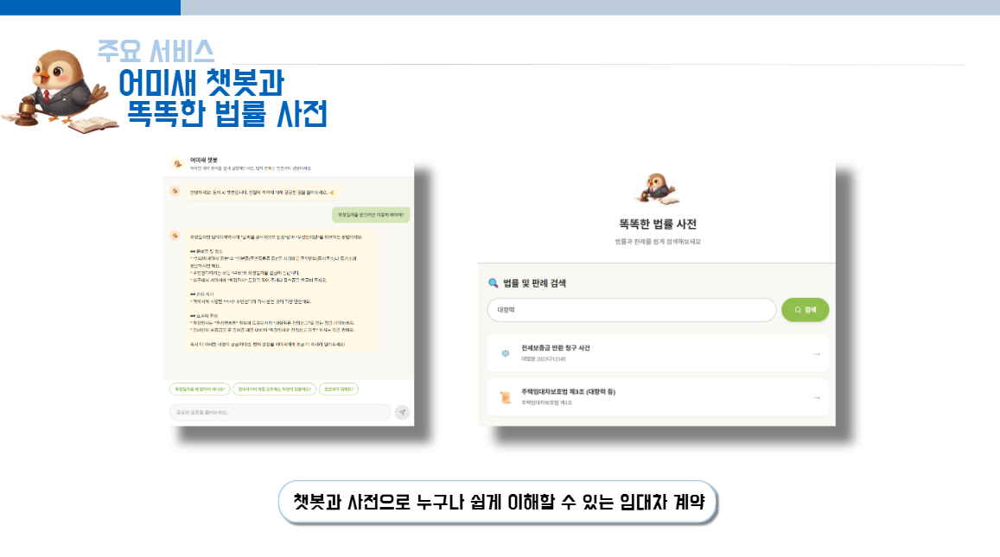
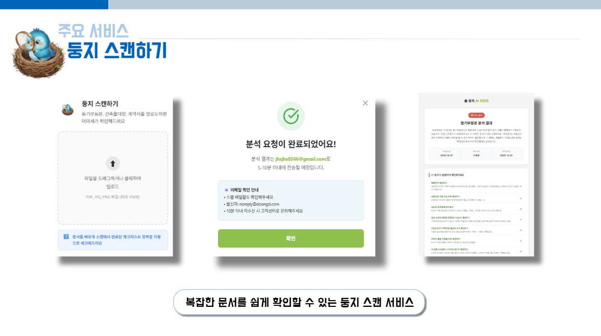
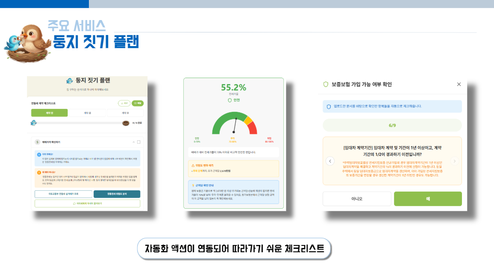

---
### 부동산 임대차 계약 시 안전한 거래를 돕는 통합 웹 서비스


## 🏠 프로젝트 개요

둥지는 자동화 액션 체크리스트 서비스를 기반으로 복잡하고 어려운 임대차 계약 과정을 쉽고 편리하게 안내하는 사회초년생을 위한 AI 기반 부동산 임대차 계약 안심 가이드 & 위험 분석 서비스 입니다.
[~~~~~~~ 를 개선하고자 기획하게 되었습니다.]

## 👥팀 ASGI

- **나정현**: Frontend Lead, PM
- **강한결**: AI Engineer (RAGFlow)
- **박준아**: Backend (n8n Workflow)
- **정환승**: Feature Developer


## ⚒️ 기능 소개

### 체크리스트 속 자동화 액션 연동
| 계약서 분석 | 깡통전세 위험도 분석 | 보증보험 가입여부 확인 |
| --- | --- | --- |
|  |  |  |
| **임대차 계약서**에서 **독소 조항**을 찾아내고 **누락된 항목**이 없는지 확인 | 최신 실거래가 기반의 **깡통전세 위험도**를 분석 | **자동 검증 시스템**을 통해 복잡한 확인 절차를 **절반 이상 개선** |

### 체크리스트 보관 및 전송
| PDF 추출 | Email 전송 | 
| --- | --- | 
|  |  | 
| 진행 상황이 담긴 체크리스트를 **PDF로 추출** 가능 | 사용자의 **이메일로도 간편하게 전송** 가능 | 

### 대화형 법률 정보 안내
| 어미새 챗봇 | 추천 법률 정보 | 
| --- | --- |
|  |  | 
| **최신 판례**와 **법률 용어**를 사용자의 **질문 맥락**에 맞춰 찾아주고, **이해 쉽게 설명**해주는 챗봇 | 대표적인 **판례·법률 큐레이션** 기능 | 


## 📃 기능 상세 설명
> ### 서비스 주요 기능 
> 
> 
> 

## 📚 기술스택
### 전체 기술 스택
### n8n아키텍쳐
### ERD 다이어그램


## 📁 프로젝트 구조
```
📁 Doongzifrontend
├── 📃 package.json
├── 📃 vite.config.ts
├── 📃 tsconfig.json
├── 📃 Dockerfile
├── 📃 docker-compose.yml
├── 📃 nginx.conf
├── 📃 index.html
└── 📁 src
    ├── 📃 main.tsx   # 엔트리포인트
    ├── 📃 App.tsx   # 라우팅 설정
    ├── 📁 api
    │   ├── 📃 chat.ts
    │   ├── 📃 checklist.ts
    │   ├── 📃 legal.ts
    │   ├── 📃 scan.ts
    │   └── 📃 index.ts
    │
    ├── 📁 components   # 공통 컴포넌트
    │   ├── 📁 common
    │   ├── 📁 figma
    │   └── 📃 (각종 UI 컴포넌트)
    │
    ├── 📁 pages       # 페이지 컴포턴트
    │   ├── 📃 ChatbotPage.tsx
    │   ├── 📃 ChecklistPage.tsx
    │   ├── 📃 HomePage.tsx
    │   ├── 📃 LoginPage.tsx
    │   ├── 📃 MyPage.tsx
    │   ├── 📃 ScanPage.tsx
    │   ├── 📃 SearchPage.tsx
    │   └── 📃 SignupPage.tsx
    │
    ├── 📁 context
    │   └── 📃 AuthContext.tsx
    │
    ├── 📁 config
    │   └── 📃 env.ts
    │
    ├── 📁 types    # TypeScript 타입 정의
    │   └── 📃 index.ts
    │
    └── 📁 guidelines
        └── 📃 Guidelines.md
```


## 🌐 배포

- **도메인**: doongzi.site
- **호스팅**: EC2 + Nginx + Let's Encrypt SSL


## 🚀 시작하기

### 1. 설치

```bash
npm install
```

### 2. 환경변수 설정

`.env.example` 파일을 복사하여 `.env` 파일을 생성하고, n8n 웹훅 URL을 설정하세요:

```bash
cp .env.example .env
```

`.env` 파일 예시:
```env
VITE_N8N_CHATBOT_WEBHOOK_URL=https://your-n8n-instance.com/webhook/chatbot
VITE_N8N_SCAN_WEBHOOK_URL=https://your-n8n-instance.com/webhook/scan
VITE_N8N_CHECKLIST_WEBHOOK_URL=https://your-n8n-instance.com/webhook/checklist
VITE_N8N_LEGAL_WEBHOOK_URL=https://your-n8n-instance.com/webhook/legal
```

### 3. 개발 서버 실행

```bash
npm run dev
```

### 4. 빌드

```bash
# 프로덕션 빌드
npm run build

# 개발 빌드
npm run build:dev
```


## 🎨 주요 색상

- **배경색**: `#FAF8F3` (밝은 크림) / 메시지 영역: `#E8E5CE` (연한 베이지)
- **포인트 컬러**: `#8FBF4D` (올리브 그린) / 액센트: `#9ACD32` (연두색)
- **AI 메시지**: `#FFFACD` (연한 노란색)
- **사용자 메시지**: `#D4E5B8` (연한 그린)