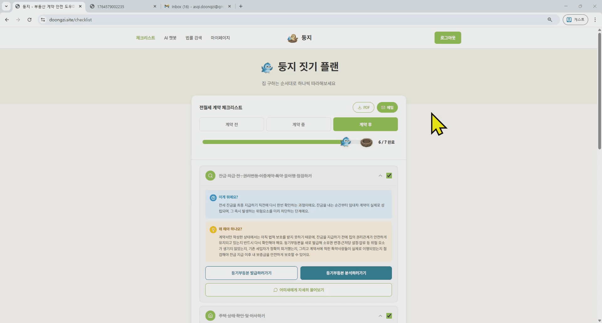
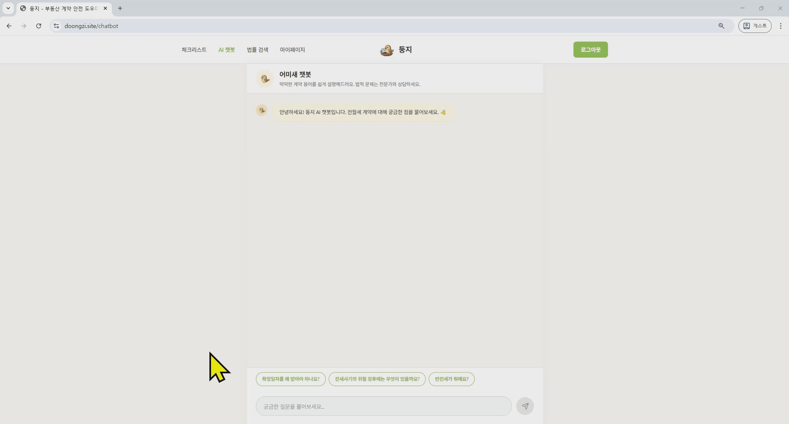
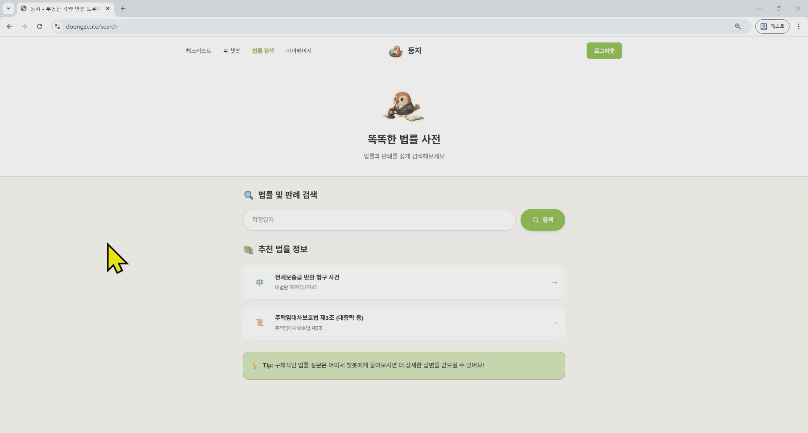
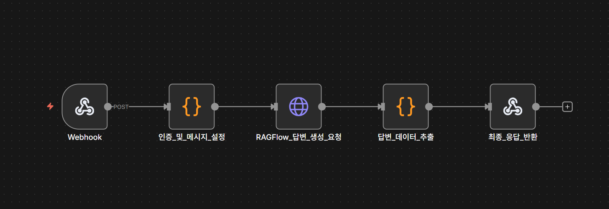
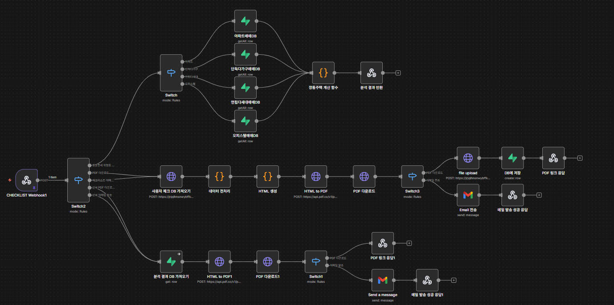
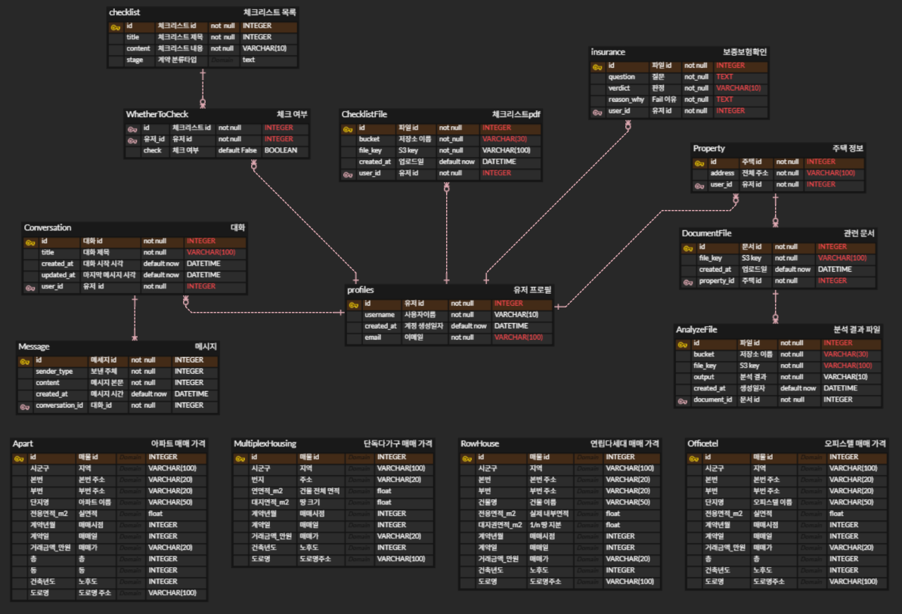

# 둥지 - 집 찾는 아기새


<br>

## 🏠 프로젝트 개요

- 서비스명 : 둥지 - 집 찾는 아기새

- 핵심 비전 : "집 찾는 아기새에게, 어미새처럼 떠먹여주는 임대차계약 안심 가이드"

- 문제 정의 및 제안 배경

  **전세사기 피해자의 75% 이상이 2030 청년층입니다. 기존의 임대차 계약 관련 서비스는 정보가 파편화되어 있고, 법률 용어 및 문서의 해설이 어려워 사회 초년생이 스스로 위험을 감지하기 어렵다는 문제점이 있었습니다.**

  **둥지는 이러한 문제점을 해결하기 위해, 사용자가 서류만 업로드하면, AI가 체크리스트를 자동으로 체크해주고, 계약 전-중-후의 과정에서 편리한 자동화 액션을 제공하는 "떠먹여주는" 가이드를 제공하기 위해 기획되었습니다.**

  <br>

  | 구분            | AS-IS                                          | TO-BE                                                        |
  | --------------- | ---------------------------------------------- | ------------------------------------------------------------ |
  | **정보 제공**   | 기능이 곳곳에 흩어져 있고 찾기 어려움          | 분산된 정보를 **통합 체크리스트**로 제공                     |
  | **사용자 경험** | 각 기능을 언제, 왜 사용해야 하는지 맥락이 없음 | 계약 단계별 **맥락과 쉬운 설명**을 명확히 제공               |
  | **기술 활용**   | 챗봇이 정해진 답변만 반복하고 자동화 미지원    | **AI가 의도를 파악**하여 답변하고, MCP 기반 **작업 자동화** 지원 |

  <br>

- **사회적 문제 : 전세사기 피해 심화**

  - **(피해자 급증)** 국토교통부에 따르면, 25년 10월 기준 누적 전세사기 피해자는 3.4만명에 달하며, 기존 정책은 피해자 구제 중심의 사후 지원에 머물러 한계를 보였습니다.
  - **(청년층에 집중된 피해)** 전체 피해자의 84%가 보증금 2억 이하의 임차인이며, 피해자의 75% 이상이 2030 청년층임을 고려하였을 때, 사회 경험이 적은 계층에 피해가 집중되고 있습니다.

  <br>

- **기존 서비스의 한계**

  - **(AI 활용 부족)** 챗봇이 사용자의 질문 의도나 맥락을 파악하지 못하고 정해진 답변만 반복합니다.
  - **(기능의 분산)** 다양한 기능이 앱 곳곳에 흩어져 있고 각 기능을 언제, 왜 사용해야 하는지에 대한 안내가 부재하여 사용자 경험이 단절됩니다.
  - **(절차 안내 부족)** 임대차 계약이 낯선 사회 초년생이 따라 하기에는 난이도가 높아 실효성이 떨어집니다.

  <br>

- **사용자 설문조사를 통한 니즈 분석 결과**

  **타겟층 :** 2030 사회초년생 30명

  **심리 상태 :** 전세사기 뉴스로 인한 막연한 공포심을 가지고 있습니다.

  **행동 패턴 :** 모르는 것이 생기면 공인중개사보다 인터넷 검색에 의존합니다.

  

  **페인포인트 :** <u>지식과 실행의 괴리</u>

  - **(높은 진입 장벽과 불신)** 서류와 용어가 너무 어려워 이해하기 힘들고(86.2%), 공인중개사에게만 의존하기에는 불안감이 큽니다(93.1%).

  - **(해결되지 않는 불안)** 인터넷 검색으로 정보를 찾으려 애쓰지만(72.4%), 여전히 위반 건축물 여부나 불리한 특약 사항을 놓칠까 봐 걱정하고 있습니다(62.1%).

  - **(정보의 부재)** 문제를 해결해줄 서비스에 대해 잘 모릅니다(79.3%)


  **원하는 솔루션 :** 

  - 어려운 부동산 문서를 분석해주는 **AI 서비스** (75.8%)

  - 계약 과정을 단계별로 안내해주는 **체크리스트** (100%) 

<br>

## 👥팀 ASGI

- **나정현**: Frontend Lead, PM

- **강한결**: AI Engineer 

- **박준아**: Backend 

- **정환승**: AI Engineer 

  <br>


## ⚒️ 기능 소개

### 체크리스트 속 자동화 액션 연동
>**1. 계약서 분석**
>
>임대차 계약서에서 독소 조항을 찾아내고 누락된 항목이 없는지 분석해줍니다. 계약서상에서 확인해야 할 요소들을 이유, 해결방안과 함께 제공해 사용자가 바로 조치할 수 있도록 안내합니다.
>
>

>**2. 깡통전세 위험도 분석**
>
>최신 실거래가를 기반으로 전세가 대비 담보여력을 산정해 깡통전세 위험도를 시각화해 제공합니다. 또한 안전 단계로 판단되더라도 근저당권 등 추가 위험요소를 반영해, **주의 단계로 전환되기까지 필요한 추가 여력(금액)**을 함께 제시하여 사용자의 합리적 의사결정을 돕습니다.
>
>

>**3. 보증보험 가입여부 확인**
>
>등기부등본·건축물대장 기반으로 보증보험 가입 가능 여부를 **AI로 분석**해, 사용자가 직접 확인해야 했던 복잡한 체크 항목을 **50% 이상** 줄였습니다. 또한 문서 내 난해한 텍스트 정보를 핵심 포인트 중심으로 구조화·요약하여, 사용자 관점의 가독성과 사용 편의성을 향상시켰습니다.
>
>

<br>

### 체크리스트 보관 및 전송
| **PDF 추출** | **Email 전송** | 
| --- | --- | 
|  |  | 
| 진행 상황이 담긴 체크리스트를 **PDF로 추출** 할 수 있습니다. | 사용자의 **이메일로도 간편하게 전송**할 수 있습니다. | 

<br>

### 대화형 법률 정보 안내
| **어미새 챗봇** | **추천 법률 정보** | 
| --- | --- |
|  |  | 
| 관련 **최신 법률**을 기반으로 사용자의 질문에 맞는 답변을 제공합니다. 복잡한 법률 표현들을 사용자가 바로 이해할 수 있도록 친절하게 설명해줍니다. | 임대차에서 자주 문제되는 쟁점을 중심으로 **대표 판례·핵심 법률(조항/용어)**을 한곳에서 찾아볼 수 있는 기능입니다. | 

<br>

## 📚 기술스택
### 전체 기술 스택


<br>

### n8n아키텍쳐

>**Ragflow**
>
>

>**체크리스트**
>- 깡통전세 위험도 분석
>- 체크리스트 PDF 변환 · Email 전송
>- 문서 분석 결과 PDF 변환 · Email 전송
>
>

>**문서 스캔**
>
>- 문서 분석
>- 체크리스트 자동 체크
>- 보증보험 가입 가능 여부 확인
>

<br>

## 🗂️ ERD 다이어그램
>

<br>

## 📁 프로젝트 구조
```
📁 Doongzifrontend
├── 📃 package.json
├── 📃 vite.config.ts
├── 📃 tsconfig.json
├── 📃 Dockerfile
├── 📃 docker-compose.yml
├── 📃 nginx.conf
├── 📃 index.html
└── 📁 src
    ├── 📃 main.tsx   # 엔트리포인트
    ├── 📃 App.tsx   # 라우팅 설정
    ├── 📁 api
    │   ├── 📃 chat.ts
    │   ├── 📃 checklist.ts
    │   ├── 📃 legal.ts
    │   ├── 📃 scan.ts
    │   └── 📃 index.ts
    │
    ├── 📁 components   # 공통 컴포넌트
    │   ├── 📁 common
    │   ├── 📁 figma
    │   └── 📃 (각종 UI 컴포넌트)
    │
    ├── 📁 pages       # 페이지 컴포턴트
    │   ├── 📃 ChatbotPage.tsx
    │   ├── 📃 ChecklistPage.tsx
    │   ├── 📃 HomePage.tsx
    │   ├── 📃 LoginPage.tsx
    │   ├── 📃 MyPage.tsx
    │   ├── 📃 ScanPage.tsx
    │   ├── 📃 SearchPage.tsx
    │   └── 📃 SignupPage.tsx
    │
    ├── 📁 context
    │   └── 📃 AuthContext.tsx
    │
    ├── 📁 config
    │   └── 📃 env.ts
    │
    ├── 📁 types    # TypeScript 타입 정의
    │   └── 📃 index.ts
    │
    └── 📁 guidelines
        └── 📃 Guidelines.md
```

<br>

## 🌐 배포

- **도메인**: doongzi.site
- **호스팅**: EC2 + Nginx + Let's Encrypt SSL

<br>

## 🚀 시작하기

### 1. 설치

```bash
npm install
```

### 2. 환경변수 설정

`.env.example` 파일을 복사하여 `.env` 파일을 생성하고, n8n 웹훅 URL을 설정하세요:

```bash
cp .env.example .env
```

`.env` 파일 예시:
```env
VITE_N8N_CHATBOT_WEBHOOK_URL=https://your-n8n-instance.com/webhook/chatbot
VITE_N8N_SCAN_WEBHOOK_URL=https://your-n8n-instance.com/webhook/scan
VITE_N8N_CHECKLIST_WEBHOOK_URL=https://your-n8n-instance.com/webhook/checklist
VITE_N8N_LEGAL_WEBHOOK_URL=https://your-n8n-instance.com/webhook/legal
```

### 3. 개발 서버 실행

```bash
npm run dev
```

### 4. 빌드

```bash
# 프로덕션 빌드
npm run build

# 개발 빌드
npm run build:dev
```


